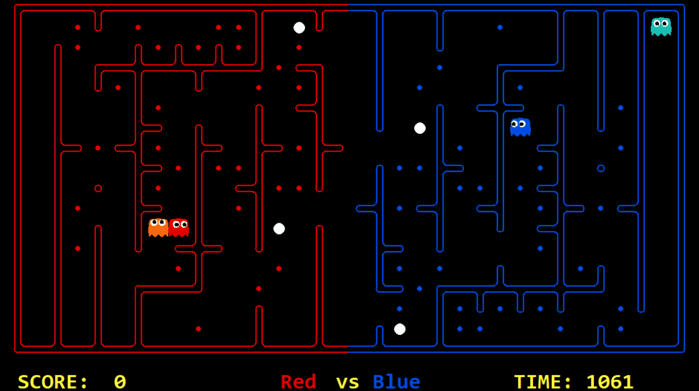

# AI Method 2 - Game Theory - Minimax

# Table of Contents
- [Governing Strategy Tree](#governing-strategy-tree)
  * [Motivation](#motivation)
  * [Application](#application)
  * [Trade-offs](#trade-offs)     
     - [Advantages](#advantages)
     - [Disadvantages](#disadvantages)
  * [Future improvements](#future-improvements)

## Governing Strategy Tree  

### Motivation  

The techniques in Game Theory try to model the outcome of a decision-making process for competitive or cooperative agents that are rational, self-interested and limited by certain rules or boundaries, in other words a game with several players. This frames the pacman task perfectly.

We introduced a strategy using the minimax algorithm. This is a strategy that uses a recursive function to explore the possible outcomes of states resulting from each decision for either the one or both players. If no enemies are in sight, this consists of recursively evaluating the possible actions for the agent to maximize the outcome for a given metric (e.g. food eaten). If an enemy is present, the strategy uses the same function to calculate the best action for the enemy player that minimizes the outcome for our agent. This allows the decision to take the next moves of the enemy into consideration when evaluating the best path to take. The algorithm does this by alternating between the maximizing agent (our team) and the minimizing agent (the enemy team) until the maximum depth is reached, and choosing the optimal decision for our agent based on the states generated from these decisions. 

### Design 

The basic algorithm consists of the following:

1) Recursively evaluates decisions for players by using decisions for the maximising player and the minimizing player if they are present. 
2) Once the maximum recursion depth is reach, it evaluates the current state using the evaluation function.
3) Chooses the actions for the agent which maximise the score for the maximising agent given the evaluation of both the maximising and minimising agent decisions.

Due to this algorithm using recursion, the main issue is high complexity, as it has to calculate all the possible combinations of actions. This is compounded if it has to calculate the actions for a minimizing player as well as a maximising player.

One solution to this is to use alpha-beta pruning. Alpha-beta pruning is a technique that involves removing elements of the decision tree which are clearly not going to influence the final decision. The intuition behind this is that if the evaluation for a generated state is cerain to be lower than one already generated, it is not explored further as it will not add any information to the problem. Alpha-beta pruning was therefore implemented to reduce such complexity and avoid timeouts.

Implementation: 

Alpha-beta pruning introduces two variables to keep track of current maximum and minimum of a branch. If an agent is minimizing it will not pick branches that are greater than the current value, therefore there is no need to keep exploring that branch. The same thing will occur with the maximizing agent when it encounters a branch that has less than the current value.

[Back to top](#table-of-contents)

### Application  
The algorithm itself is simple to implement. However there were some critical decisions that needed to be made for the algorithm to function. 

1) First there is need for an evaluation function that returns the reward at each possible leaf of the tree, similar to a heuristic function. In our implementation we used the same values as for the A* heuristic.
2) There is need to add an exception when no enemy is in sight, so the algorithm only works on maximising the agent's decisions. 
3) Finally, some combination of actions could have the same value if they end in the same position. However, to reach that position more steps were required for some actions than others (such as going forward and then going back), but the value evaluation value that backpropagates will be the same of all of them, then an additional cost to reach that state must be include for every recursion. 

### Optimisation
Despite alpha-beta pruning being used, time complexity was still and issue. Through trial and error in the competition we found that a depth value of four was necessary to avoid timeouts.

In the image it is possible to observe all the final states the red agent is considering making a decision over the next step.

[Back to top](#table-of-contents)

### Trade-offs  
*Advantages*  
Takes in consideration the next possible action for the adversary. It plans a better short-term strategy than A*.

*Disadvantages*
High complexity, which is exponential for depth: O(A^d), where A stand for possible actions and d for the depth. Alpha-beta pruning can improve the average case, but the worst case scenario may still occur.

Balancing weights to have general solution is challenging.
[Back to top](#table-of-contents)

### Future improvements  

Only the closest enemy is taken in consideration, but it may be implemented a solution to include a second minimizing agent.
No decision tree was developed to change weights in the evaluation function, due increasing complexity, as such tree must be implemented recursively, but it is possible.

Roger B. Myerson, Game Theory: Analysis of Conflict
[Back to top](#table-of-contents)
