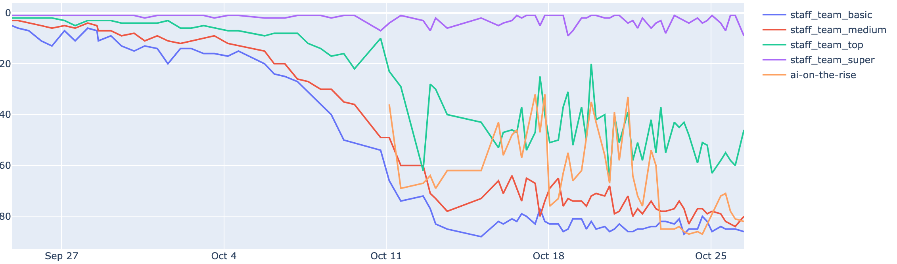

## Analysis

A subset of the different approaches taken for the competition were compared for analysis of overall performance. This was done by running the pacman with opposing teams and calculating the win ratio for each of them against each other opponent. The approaches chosen were:

Defence
* Baseline
* Defence method

Attack
* Baseline
* A star + heuristic
* Minimax
* Approximate Q Learning

To determine which is the best combination between the defence approach and the attack approach among the different strategies, 100 simulations with random mazes were run for each combination. 

First, an Attack approach is set as base (A star) and the two different Defence approaches are tested to select the one with the best performance. 
* Team 1 – Defence:  Baseline + A star
* Team 2 – Defence:  Defence method + A star

The best Defence strategy is Defence method, beating the baseline 73 times in the simulation, with only 6 defeats and the remaining 21 games as ties.

Then, the best Defence approach selected from the above is set as base (Defence method), and the 4 different Attack approaches are tested.
* Team 1 – Attack:  Defence method + Baseline
* Team 2 – Attack:  Defence method + A star
* Team 3 – Attack:  Defence method + Minimax
* Team 4 – Attack:  Defence method + Approximate Q Learning

As it can be seen, the best Attack approach is A star (heuristic), with a substantial improvement in winning ratio against the other three methodologies, as well as a higher average score. Additionally, the three implemented approaches beat the Baseline Attack, and the MiniMax and Approximate Q-Learning with similar performance, only with a slightly difference in favour of the MiniMax approach.

### Overall Performance

As can be seen, from the initial approach through to our final approach, our performance actually decreased. This corresponds to trying out different methods, however even when trying to improve A*, we did not win against Staff_TOP, which was the goal of improving the original strategy. 

### Challenges  

Some general challenges to the project were:
1) Formulating an effective goal or strategy
2) Balancing complexity with simplicity
3) Playing with opponents with dynamic strategies. Making an intelligent agent that acts well generally is of course the hardest challenge of all. 

The different approaches tried all have their relative strengths and weaknesses. One major challenge was deciding where to devote energy in development. While a more complex strategy such as Q-learning or minimax may have payed dividends if it had been focussed on more, a heuristic search was guaranteed to work in the alotted timeframe given to make each move. Additionally, there are a myriad of strategies that could be attempted, and combined to improve the strategy, and on top of this, from observing replays it was often a small mistake that lead to a defeat rather than a flawed overall strategy, however when fixing one problem often a new one sprung up instead. 

## Conclusions and Learning

The competition was difficult! But having a setting to practice different AI techniques was very informative. One of the main take-aways was that every strategy has its pros and cons. There are some that will perform well at some tasks, but are less good at others, and there is always a trade off between complexity and optimality. 
The second and third strategies employed proved not to be as effective as A*, however this could be due to implementation, or simply the problem being solved. It is likely that with more variety a better solution could have been found.

